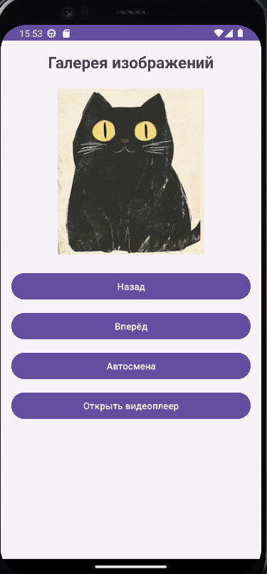
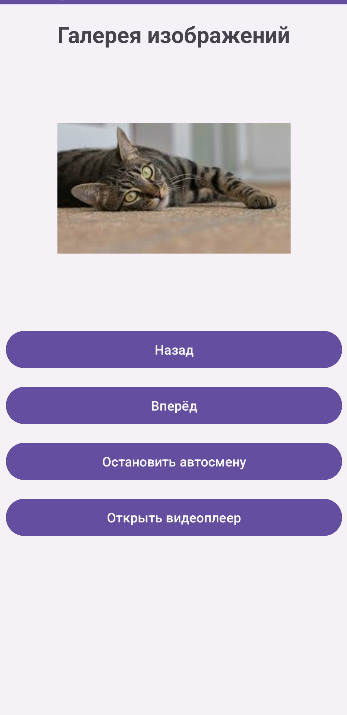

<div align="center">

# Отчет

</div>

<div align="center">

## Практическая работа №8

</div>

<div align="center">

## Ресурсы. Работа с медиа-элементами

</div>

**Выполнил:**
Майстренко Константин Александрович
**Группа:** инс-б-о-24-2

---

### Цель работы

Изучить способы добавления и отображения графических ресурсов, научиться работать с аудио- и видеофайлами в Android-приложениях, освоить управление воспроизведением медиа-контента.

### Ход работы

В ходе выполнения практической работы было создано Android-приложение, демонстрирующее работу с различными типами ресурсов: изображениями, аудио и видео.

Сначала были подготовлены необходимые ресурсы приложения. Для этого изображения были добавлены в папку `drawable`, а аудио- и видеофайлы — в папку `raw`. Это позволило использовать их как встроенные ресурсы проекта.

Далее была реализована галерея изображений. На экране приложения отображался `ImageView`, а переключение изображений осуществлялось с помощью кнопок «Вперёд» и «Назад». Также была добавлена кнопка автоматической смены изображений, которая запускала слайд-шоу с определённым интервалом времени. Для автоматической смены использовался таймер.

После этого был реализован экран видеоплеера. Для воспроизведения видео использовался `VideoView`, а для управления воспроизведением — `MediaController`. Дополнительно был добавлен `SeekBar`, с помощью которого можно было изменять громкость воспроизведения через `AudioManager`.

Затем была реализована работа с фоновым аудио. При запуске приложения аудиофайл начинал воспроизводиться в фоне. При переходе к воспроизведению видео фоновое аудио ставилось на паузу, а после завершения или остановки видео снова возобновлялось с задержкой. Для фонового воспроизведения использовался `MediaPlayer` с зацикливанием.

Таким образом, в приложении были объединены все основные задания практической работы: отображение изображений, управление видео и работа с аудио в фоновом режиме.

Ниже приведены скриншоты выполнения работы.

<div align="center">


*Рисунок 1. Галерея изображений в приложении*

</div>

<div align="center">


*Рисунок 2. Экран видеоплеера с элементами управления*

</div>

<div align="center">


*Рисунок 3. Итоговый результат работы приложения с медиа-ресурсами*

</div>

### Вывод

В результате выполнения практической работы были изучены способы использования различных ресурсов в Android-приложениях.
Я научился добавлять и отображать изображения, воспроизводить аудио и видеофайлы, а также управлять медиа-контентом с помощью `MediaPlayer`, `VideoView`, `MediaController`, `AudioManager` и `SeekBar`.
Практическая работа позволила лучше понять, как организуется работа с мультимедиа в Android-приложениях.

### Ответы на контрольные вопросы

1. **Какие типы ресурсов существуют в Android? Для чего предназначены папки drawable, raw, values?**
   В Android ресурсы делятся на несколько основных типов: изображения, строки, цвета, размеры, макеты, меню, аудио- и видеофайлы.

   * `drawable` — папка для графических ресурсов: изображений и XML-рисунков;
   * `raw` — папка для файлов в исходном виде, например аудио, видео или текстовых файлов;
   * `values` — папка для строк, цветов, размеров, массивов и стилей.

2. **Как добавить изображение в приложение и отобразить его в ImageView двумя способами?**
   Первый способ — использовать ресурс из папки `drawable`:

   ```xml
   android:src="@drawable/image1"
   ```

   или в коде:

   ```java
   imageView.setImageResource(R.drawable.image1);
   ```

   Второй способ — загрузить изображение из файловой системы, например с помощью `BitmapFactory`, указав путь к файлу.

3. **Опишите жизненный цикл MediaPlayer. Какие методы необходимо вызвать для воспроизведения аудиофайла из ресурсов?**
   Основные состояния `MediaPlayer`: создание, подготовка, воспроизведение, пауза, остановка и освобождение ресурсов.
   Для воспроизведения аудиофайла из ресурсов обычно делают так:

   ```java
   MediaPlayer mediaPlayer = MediaPlayer.create(this, R.raw.audio_sample);
   mediaPlayer.start();
   ```

   При завершении работы нужно вызвать:

   ```java
   mediaPlayer.release();
   ```

4. **Для чего используется класс AudioManager? Как получить его экземпляр и изменить громкость?**
   `AudioManager` используется для управления звуковыми потоками устройства, например громкостью музыки.
   Получение экземпляра:

   ```java
   AudioManager audioManager = (AudioManager) getSystemService(Context.AUDIO_SERVICE);
   ```

   Изменение громкости:

   ```java
   audioManager.setStreamVolume(AudioManager.STREAM_MUSIC, newVolume, 0);
   ```

5. **Что такое VideoView и MediaController? Как их использовать для создания простого видеоплеера?**
   `VideoView` — это виджет для воспроизведения видео.
   `MediaController` — это стандартная панель управления видео, содержащая кнопки воспроизведения, паузы и перемотки.
   Для использования нужно установить `MediaController` для `VideoView`, задать путь к видео и запустить воспроизведение:

   ```java
   mediaController = new MediaController(this);
   videoView.setMediaController(mediaController);
   videoView.setVideoURI(uri);
   videoView.start();
   ```

6. **Почему при обновлении UI из TimerTask нужно использовать runOnUiThread()?**
   Потому что `TimerTask` выполняется в фоновом потоке, а элементы интерфейса Android можно изменять только из главного UI-потока.
   Поэтому обновление `ImageView`, `TextView`, `SeekBar` и других элементов нужно выполнять через `runOnUiThread()`.

7. **Как сделать, чтобы аудиофайл воспроизводился бесконечно (зацикливался)?**
   Для этого у `MediaPlayer` используется метод:

   ```java
   mediaPlayer.setLooping(true);
   ```

   После этого аудио будет автоматически запускаться заново после завершения.

8. **Какие разрешения необходимы для доступа к медиафайлам на внешнем хранилище в разных версиях Android?**
   Если медиафайлы находятся внутри ресурсов приложения (`drawable`, `raw`), дополнительные разрешения не нужны.
   Если файлы читаются из внешнего хранилища, в старых версиях Android использовалось разрешение `READ_EXTERNAL_STORAGE`, а в более новых версиях, например Android 13+, применяются более узкие разрешения, такие как `READ_MEDIA_IMAGES`, `READ_MEDIA_VIDEO`, `READ_MEDIA_AUDIO`.

### Список литературы

1. Phillips, B., Stewart, K., & Marsicano, K. *Android Programming: The Big Nerd Ranch Guide* (5th Edition). Big Nerd Ranch Guides, 2022.
2. Документация Android Developers. Руководство по ресурсам приложения.
3. Документация Android Developers. Руководство по работе с `MediaPlayer`.
4. Гриффитс Д., Гриффитс Д. *Head First. Программирование для Android*. Питер, 2021.
5. Соколова В. В. *Разработка мобильных приложений на платформе Android*. М.: Юрайт, 2021.
